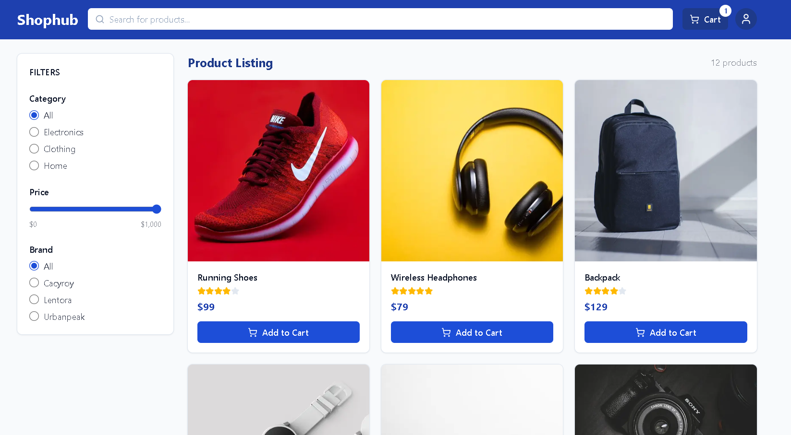
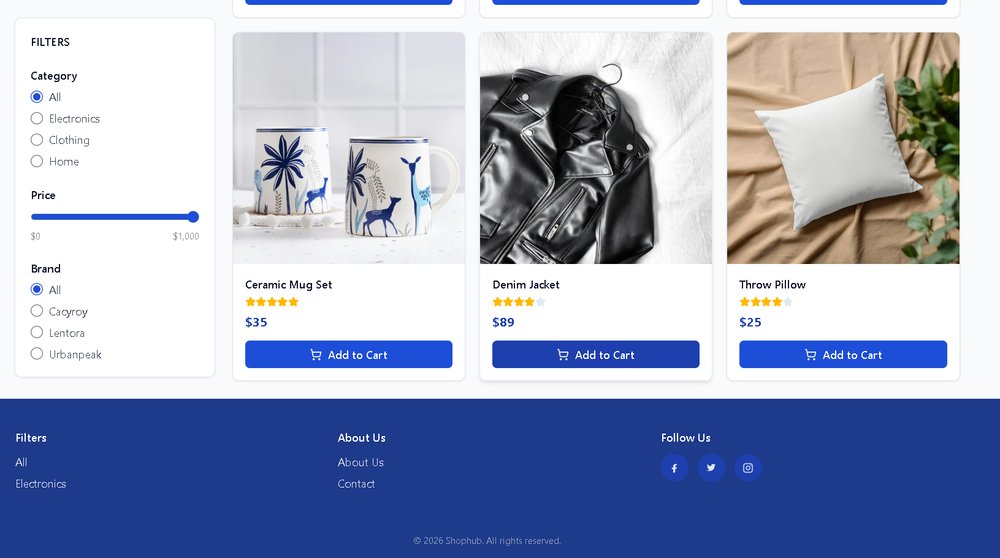
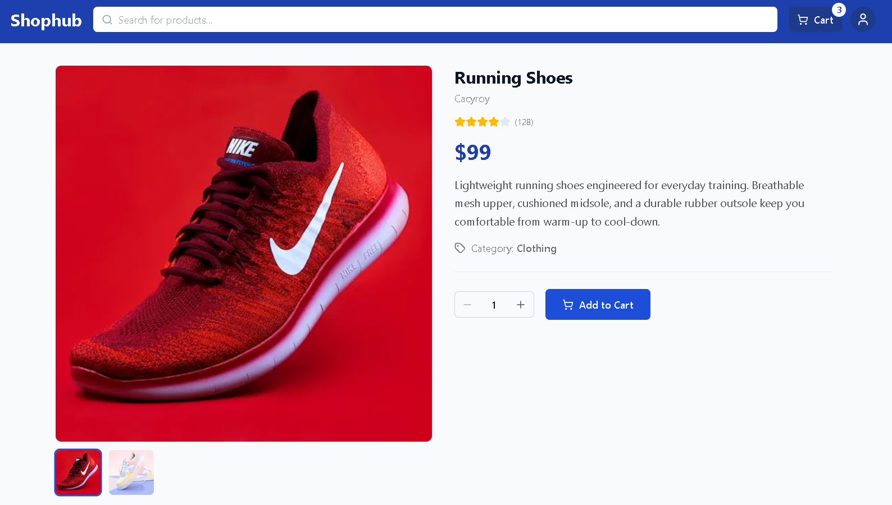
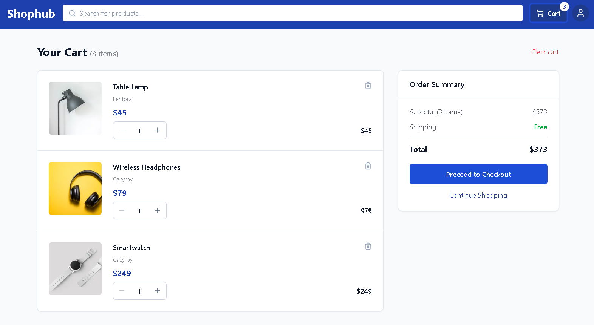

# Shophub — E-Commerce Frontend Assignment

A fully featured e-commerce storefront built with **Next.js 16**, **React 19**, **TypeScript**, **Tailwind CSS v4**, and **Zustand**. Submitted as part of the Whatbytes Frontend Assignment.

🔗 **Live Demo:** (https://ecommerce-app-what-bytes.vercel.app/)

---

## Tech Stack

| Layer | Technology |
|---|---|
| Framework | Next.js 16 (App Router) |
| UI Library | React 19 |
| Language | TypeScript 5 |
| Styling | Tailwind CSS v4 |
| State Management | Zustand 5 with `persist` middleware |
| Icons | Lucide React |
| Deployment | Vercel |

---

## Features

### Home Page (`/`)
- Responsive product grid — 3 columns desktop / 2 tablet / 1 mobile
- Sidebar with category, price range, and brand filters
- All filters sync bidirectionally with URL search params (`?category=electronics&price=0-500&brand=Cacyroy`)
- Live result count updates as filters are applied
- Full-text search across title, brand, and category
- Mobile filter drawer with active-filter badge indicator
- Skeleton loading state via Next.js `loading.tsx` + Suspense

### Product Detail Page (`/product/[id]`)
- Statically generated at build time (`generateStaticParams`)
- Image carousel with thumbnail navigation
- Rating stars, review count, category badge
- Quantity selector (1–10) with Add to Cart
- "Added!" confirmation flash on the button

### Cart Page (`/cart`)
- Full cart item list with image, title, brand, unit price, line total
- Inline quantity controls and per-item remove button
- Order summary: subtotal, conditional shipping (free above $100), total
- "Clear cart" action
- Skeleton loading state + empty state with contextual copy

### Filters
- URL-driven: all filter state lives in the URL — links are shareable and bookmarkable
- Server Component reads `searchParams` and filters the product list at render time — no client-side fetch
- Supported filters: `?q=`, `?category=`, `?price=min-max`, `?brand=`

### Cart Persistence
- Zustand `persist` middleware writes to `localStorage` under the key `shophub-cart`
- Cart survives hard refreshes and browser restarts
- Hydration guards on `CartBadge` and `CartPage` prevent SSR/client mismatch

---

## Architecture

```
src/
├── app/                        # Next.js App Router
│   ├── layout.tsx              # Root layout — Header + Footer
│   ├── page.tsx                # Home page (Server Component)
│   ├── loading.tsx             # Home page Suspense skeleton
│   ├── not-found.tsx           # 404 page
│   ├── cart/
│   │   ├── page.tsx            # Cart page (Client Component)
│   │   └── loading.tsx         # Cart skeleton
│   └── product/[id]/
│       ├── page.tsx            # Product detail (Server Component, SSG)
│       └── loading.tsx         # Detail skeleton
│
├── components/
│   ├── layout/
│   │   ├── Header.tsx          # Logo, search bar, cart badge, profile
│   │   └── Footer.tsx          # Links, social icons, copyright
│   ├── product/
│   │   ├── ProductCard.tsx     # Grid card with Add to Cart
│   │   ├── ProductGrid.tsx     # Responsive grid + empty state
│   │   ├── ProductImageCarousel.tsx
│   │   ├── ProductPurchasePanel.tsx  # Qty selector + Add to Cart (detail)
│   │   ├── AddToCartButton.tsx       # Reusable button with flash feedback
│   │   ├── QuantitySelector.tsx
│   │   └── RatingStars.tsx
│   ├── filters/
│   │   ├── Sidebar.tsx         # Desktop sticky + mobile drawer
│   │   ├── CategoryFilter.tsx
│   │   ├── PriceRangeFilter.tsx
│   │   └── BrandFilter.tsx
│   ├── cart/
│   │   ├── CartBadge.tsx       # Live item count in header
│   │   ├── CartItem.tsx        # Row with qty controls + remove
│   │   ├── CartSummary.tsx     # Subtotal / shipping / total
│   │   └── EmptyCart.tsx
│   └── ui/
│       ├── SearchBar.tsx
│       ├── EmptyState.tsx      # Contextual empty state for the grid
│       ├── ProductCardSkeleton.tsx
│       └── PageSkeleton.tsx
│
├── store/
│   └── cartStore.ts            # Zustand store with persist middleware
│
├── hooks/
│   └── useUrlFilters.ts        # Read/write URL search params for filters
│
└── lib/
    ├── types.ts                # Product, CartItem, ProductFilters
    ├── data/
    │   └── products.ts         # Mock product data + getProducts / getProductById
    └── utils/
        ├── filterProducts.ts   # Pure filter + parse functions
        └── formatPrice.ts      # Intl.NumberFormat currency helper
```

---

## Data Flow

```
URL Search Params (?category=electronics&price=0-500)
        │
        ▼
app/page.tsx  (Server Component — reads searchParams prop)
        │
        ├── parseFilters()   →  typed filter object
        ├── getProducts()    →  full mock product array
        └── filterProducts() →  filtered subset
                │
                ▼
        <ProductGrid products={filtered} />   ← Server render
                │
                ▼
        <ProductCard />   ← "use client" — Add to Cart calls useCartStore
                │
                ▼
        useCartStore.addItem()  →  Zustand state  →  localStorage
```

---

## State Management

| State | Owner | Persistence |
|---|---|---|
| Cart items + quantities | Zustand `useCartStore` | `localStorage` via `persist` |
| Active filters (category, price, brand, search) | URL search params | URL (shareable) |
| Mobile sidebar open/closed | `useState` in `Sidebar` | Ephemeral |
| Add-to-cart flash feedback | `useState` in `ProductCard` / `AddToCartButton` | Ephemeral |

---

## Local Setup

```bash
# 1. Clone the repository
git clone https://github.com/<your-username>/ecommerce-app.git
cd ecommerce-app

# 2. Install dependencies
npm install

# 3. Run the development server
npm run dev
```

Open [http://localhost:3000](http://localhost:3000) in your browser.

```bash
# Type-check
npx tsc --noEmit

# Lint
npm run lint

# Production build
npm run build
npm start
```

No environment variables are required — the app runs entirely on local mock data.

---

## Deployment

The project is deployed on **Vercel** using zero-config Next.js integration.

### Steps to deploy your own instance

1. Push the repository to GitHub.
2. Go to [vercel.com/new](https://vercel.com/new) → import the repo.
3. Leave all settings at their defaults (Vercel auto-detects Next.js).
4. Click **Deploy**.
5. Copy the generated URL and paste it into the `Live Demo` link at the top of this README.

```bash
# Or deploy via Vercel CLI
npx vercel --prod
```

---

## Screenshots

### Home Page

Shows the responsive product grid, search bar, and filters.



---

### Home Page (Filters Applied)

Demonstrates category, brand, and price filtering with URL-synced state.



---

### Product Detail Page

Displays product images, ratings, quantity selector, and Add to Cart functionality.



---

### Cart Page

Shows cart items, quantity controls, subtotal, shipping, and total calculation.


